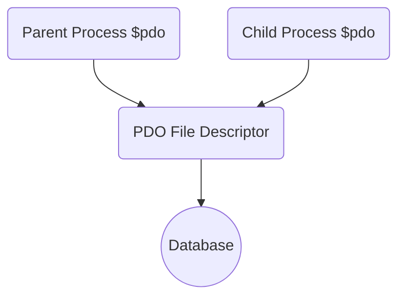

# php-pcntl-sample

## Overview
This repository aims to study the behaviour of `pcntl` functions.
The manual of this process control library can be found [HERE](https://www.php.net/manual/en/book.pcntl.php).

The samples are running on `PHP 8.1`.

## Manual
### Local Setup
```shell
> php -v
PHP 8.1.14 (cli) (built: Jan 12 2023 02:41:00) (NTS)
Copyright (c) The PHP Group
Zend Engine v4.1.14, Copyright (c) Zend Technologies
    with Zend OPcache v8.1.14, Copyright (c), by Zend Technologies
    
> php composer.phar install
```

### Samples
#### Basic
In this package, we would like to understand what `pcntl` is.
Here is a simple example:
https://www.php.net/manual/en/pcntl.example.php

##### Tick
Understand what is a Tick in PHP.
```shell
> chmod +x ./src/Basic/Tick.php 
> php ./src/Basic/Tick.php
...
```

##### Fork
This script demonstrates how do we use `pcntl_signal` functions to fork a PHP process.
In this example, child process will count from 1 to 50 but parent process will only count the even numbers.

To intercept the `SIGTERM` signal, `define(ticks=1)` and `pcntl_signal` are being used.
Let's try running `kill <parent process>` and see what will happen!

One interesting thing is that everything will be copied to the fork process:

**How do we know?** Let's take a look at the log count - the count starts at 1 for the child process!
```shell
> chmod +x ./src/Basic/Fork.php 
> php ./src/Basic/Fork.php
...
```

##### ForkWithoutTick
This script is the variation of `Fork` but we don't use `define(ticks=1)` because this is an expensive call.
Instead of `Tick`, we will use `pcntl_signal_dispatch` function in order to call signal handlers for pending signals.

Why `pcntl_signal_dispatch` is added to the loop? Let's move it outside and see what will happen!

> The pcntl_signal_dispatch() function calls the signal handlers installed by pcntl_signal() for each pending signal.
ref: https://www.php.net/manual/en/function.pcntl-signal-dispatch

That means we should check it manually if you would like to interrupt the process.

```shell
> chmod +x ./src/Basic/ForkWithoutTick.php 
> php ./src/Basic/ForkWithoutTick.php
...
```

##### ForkWithPdo
This script demonstrates we should not copy PDO instance to forked processes.

Although PDO objects are forked to the child process, just like the other variables,
the file descriptor of PDO extension is still shared, i.e.


When child process finishes successfully, it will close all the PDO connections automatically.
Since the underlying FD has been closed, the parent process cannot use the `$pdo` variable to access DB after the child process is finished.

```shell
> # set up your DB
> # update the database name, username and password

> chmod +x ./src/Basic/ForkWithPdo.php
> php ./src/Basic/ForkWithPdo.php
...
```

#### Batch
This package contains all the sample batches which enable parallel processing in PHP.

##### Process Based

###### File Based
I maintained this kind of batch in the past. The synchronisation is done by files.

The parent process fetches the workload from database and split them into `n` slices and then
creates `n` mini batches to process the data.

The mini batch will write a `.running` file as a flag to indicate that it is still handling the workload.
Once the processing is finished, it writes the output to `.out` file and remove the `.running` file.

Parent process is watching the files at the same time.
Once all child processes finished the operation, it will merge the output and conclude the batch.

```shell
> chmod +x ./src/Batch/FileBased/Batch.php
> chmod +x ./src/Batch/FileBased/MiniBatch.php

> php ./src/Batch/FileBased/Batch.php
...
> # at the same time, please `watch ./out` and see what is happening.
```

###### pcntl Based
Obviously we can achieve the same goal by using `pcntl` functions. We will skip it here.

##### Multi-threading Solution
A normal multi-threading approach which leverages the `pthreads` extension.

###### `pthreads` extension
> pthreads is an object-orientated API that provides all of the tools needed for multi-threading in PHP. PHP applications can create, read, write, execute and synchronize with Threads, Workers and Threaded objects.

However, `pthreads` extension is unmaintained anymore.
https://www.php.net/manual/en/intro.pthreads.php

###### `parallel` extension
> parallel is a parallel concurrency extension for PHP ≥ 7.2.0. As of parallel 1.2.0, PHP ≥ 8.0.0 is required.

https://www.php.net/manual/en/intro.parallel.php

Let's try it out!
```shell
> pecl install parallel
...
checking PHP version... 80114
checking for ZTS... configure: error: parallel requires ZTS, please use PHP with ZTS enabled
ERROR: `/private/tmp/pear/temp/parallel/configure --with-php-config=/opt/homebrew/opt/php@8.1/bin/php-config' failed
...

# install `phpbrew` for variants
> brew install phpbrew
...
> phpbrew init
> phpbrew lookup-prefix homebrew
# load the bash script
...

> phpbrew install php-8.1.18 +default +zts
...
# you may need to install the missing tools
> brew install bzip2 openssl
...

> phpbrew use php-8.1.18
> php -v
PHP 8.1.18 (cli) (built: May  7 2023 13:07:35) (ZTS)
Copyright (c) The PHP Group
Zend Engine v4.1.18, Copyright (c) Zend Technologies
# Let's try again!
> phpbrew ext install parallel
> php -m | grep parallel
parallel
```

It's good to read this [page](https://www.php.net/manual/en/philosophy.parallel.php) first.
```shell
> chmod +x ./src/Batch/Parallel/Batch.php
> php ./src/Batch/Parallel/Batch.php
```